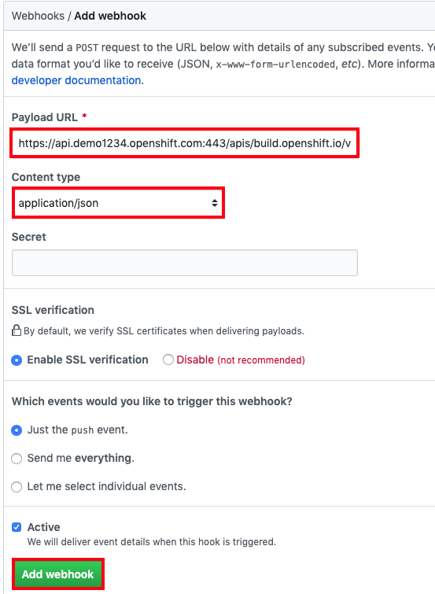
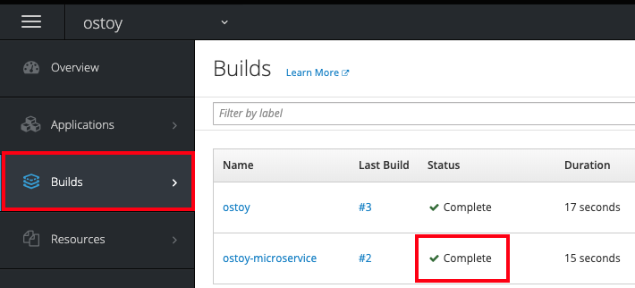
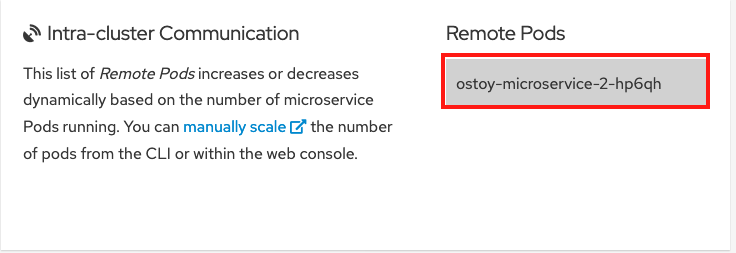

## Leveraging Source-to-Image (S2I) webhooks for automated deployment
If we'd like to automatically trigger a build and deploy anytime we change the source code we can do that by using a webhook.

See [Triggering Builds](https://docs.openshift.com/dedicated/3/dev_guide/builds/triggering_builds.html) for more details.

#### 1. Get the trigger secret
Retrieve the GitHub webhook trigger secret using the command below. You’ll need use this secret in the GitHub webhook URL.

`oc get bc/ostoy-microservice -o=jsonpath='{.spec.triggers..github.secret}'`

You will get a response similar to:
`o_3x9M1qoI2Wj_czRWiK`

Note the secret as you will need to use it shortly.

#### 2. Retrieve the GitHub webhook trigger URL
You will need to get the GitHub webhook trigger url from the buildconfig.  Use following command to retrieve it

`oc describe bc/ostoy-microservice`

You will get a response with much data but look for the line that looks like

```
Webhook GitHub:
	URL:	https://api.demo1234.openshift.com:443/apis/build.openshift.io/v1/namespaces/ostoy-s2i/buildconfigs/ostoy/webhooks/<secret>/github
```
#### 3. Replace the secret
In the URL retrieved in the last step replace the `<secret>` text with the actual secret you received in step 1 above.  Your URL will look like:

`https://api.demo1234.openshift.com:443/apis/build.openshift.io/v1/namespaces/ostoy-s2i/buildconfigs/ostoy-microservice/webhooks/o_3x9M1qoI2Wj_czRWiK/github`

#### 4. Setup the webhook URL in GitHub repository
- In your repository, click on *Settings > Webhooks > Add webhook*


- Paste the URL from step 4 into the "Payload URL" field
- Change the "Content type" to `application/json`
- Click add webhook at the bottom



You should see a message from GitHub stating that your webhook was successfully configured. Now, whenever you push a change to your GitHub repository, a new build will automatically start, and upon a successful build a new deployment will start.

#### 5. Make a change and see the update
Now we will make a change in our source code and see it automatically trigger a build and deployment.  We saw in our Networking section that the colors of the box randomly change colors.  Now we will make that box only display greyscale.

- Go to the source code in your repository `https://github.com/<username>/ostoy/blob/master/microservice/app.js`
- Edit the file
- Comment out line 8 (containing `let randomColor = getRandomColor();`)
- Uncomment line 9 (containing `let randomColor = getRandomGrayScaleColor();`)
- Enter a message for the update like "changed box to greyscale colors"
- Click *Commit* at the bottom to commit the changes to the master branch

#### 6. View the build run and Deployment complete
Immediately, in your cluster web UI, click under *Builds > Builds* and you will see that it says "running" then it will show "complete".  Once complete the deployment begins.  You can also check the status by running `oc status`.  



#### 7. View change in browser
Once the deployment has finished go back to OSToy app in your browser, access the *Networking* menu item on the left.  You will now see that the box color is limited to greyscale colors only.


